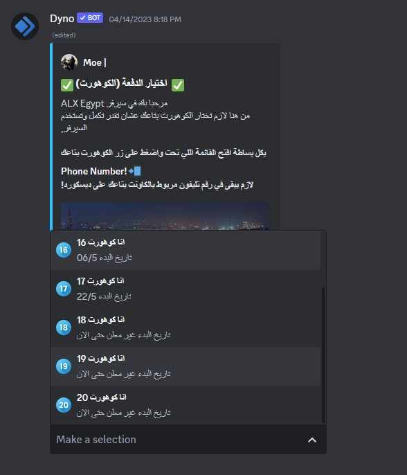

!!!warning Cohort 14 notice
Individuals who are a part of cohort 14 are not able to utilize the bot for the verification process.
Kindly contact a staff to undergo the necessary verification, as additional verification steps are required.
!!!
# ✅ Verification

Before you can start using our server, you need to verify yourself. This is done by choosing which cohort you are in.

### 🎓 Choose a Cohort

Choosing a cohort is an important step in your journey with ALX Egypt. A cohort is a group of students who start and finish the program together, providing a supportive learning community throughout the course.

### 👥 How to choose a cohort?

1. Navigate to the channel called #✅・〉𝐕𝐞𝐫𝐢𝐟𝐲. This should be the first and only channel you see in the server post verification.

2. Look for the verification message sent by dyno.
   

3. Click on `Make a selection`, a drop down menu will open with the cohorts inside of it.

4. After chooseing a cohort the server should now open to you, you can see and navegait bettwen channels using the channel list on the left

