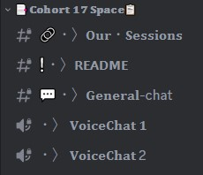

# 🎓 Cohort Channels

The cohort channels are a group of channels that are only accessible by members of a specific cohort. These channels provide a space for cohort members to connect with each other, collaborate on projects, and receive support from their peers.

Within your cohort channels, you'll find a chat channel where you can communicate with other members of your cohort, as well as a voice chat for more interactive discussions. Additionally, each cohort has a README channel where moderators post important announcements and updates specific to your cohort.

Make sure to use these channels for their intended purpose, and respect the community guidelines and rules. If you have any questions about using cohort channels, don't hesitate to ask for help in the chat channels.

## Those are the Cohort channels and heres how to use them!

### `🔗・〉𝐎𝐮𝐫・𝐒𝐞𝐬𝐬𝐢𝐨𝐧𝐬`
In this channel, we post your cohort content, including session recordings, slides, and other helpful resources.

### `❕・〉𝗥𝗘𝗔𝗗𝗠𝗘` 
This channel is your cohort's announcement channel, where moderators post important updates and announcements specific to your cohort.

### `💬・〉𝐆𝐞𝐧𝐞𝐫𝐚𝐥-chat`
This is your chat channel to connect with other members of your cohort and discuss ideas or ask for help.

### `📞・〉𝐕𝐨𝐢𝐜𝐞𝐂𝐡𝐚𝐭 `
This is your cohort's voice chat channel, where you can have more interactive discussions with other members of your cohort.