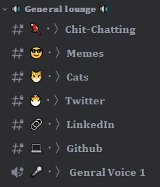

# 💬 The General Lounge

The General Lounge contains server-wide channels that are not dedicated to main learning topics, but can provide a fun and social environment for community members. You can share memes and links to social media in these channels, and access our AI bot for various commands and interactions.

  *Keep in mind that while these channels can be enjoyable and entertaining, it's important to follow the community guidelines and rules. If you have any questions or are unsure where to post something, don't hesitate to ask for help in the chat channels. *

## Those are the General channels and heres how to use them!

### `🦜・〉𝐂𝐡𝐢𝐭-𝐂𝐡𝐚𝐭𝐭𝐢𝐧𝐠`
This is the main text channel in the server, and messages posted here will be seen by every member in the server, not just your cohort. If you have a question, make sure to provide as much context as possible since not all members will have the same tasks as you. Note that this channel is meant for casual chatting, so it's not recommended to ask task-related questions here.

### `🤖・〉𝐀𝐬𝐤・𝐀𝐢`
This is the only channel in the server where you can access our AI bot. You can write any message and the bot will reply to you. If you want the bot to ignore your message, simply add a "!" at the beginning of it.

### `😎・〉𝐌𝐞𝐦𝐞𝐬`
This channel is dedicated to sharing memes and is where our "memelords" reside.

Keep in mind that all server rules and guidelines also apply to this channel. Posting any content that violates these rules may result in a mute and possible loss of access to the channel.
### `😾・〉𝐂𝐚𝐭𝐬`
This channel is dedicated to posting cat content because we love cats in the server!

### `🐣・〉𝐓𝐰𝐢𝐭𝐭𝐞𝐫`
This is the only channel where you are allowed to post Twitter profile links.

### `🔗・〉𝐋𝐢𝐧𝐤𝐞𝐝𝐈𝐧`
This is the only channel where you are allowed to post LinkedIn profile links.

### `💻・〉𝐆𝐢𝐭𝐡𝐮𝐛`
This channel is dedicated to sharing your GitHub profile or any repositories you want to showcase, as long as they meet our guidelines.

### `🎤・〉𝐆𝐞𝐧𝐫𝐚𝐥 𝐕𝐨𝐢𝐜𝐞`
This is our server-wide voice channel. You may not have access to it unless there is a moderator or admin already in the channel. In that case, you will regain access to the channel.
