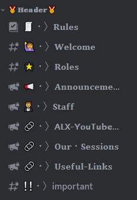

# 🤖 Header Channels 

The header channels are channels that members cannot type in. Instead, they are used by moderators to pin important messages and send announcements to the rest of the community. These channels are a great way to keep everyone informed about upcoming events, changes to the program, and other important information. Make sure to check these channels regularly to stay up-to-date on everything happening in the ALX Egypt community.

### Those are the header channels and heres how to use them!


### `🧾・〉𝐑𝐮𝐥𝐞𝐬`
This channel is where we have our community guidelines and rules. Make sure to check them out and familiarize yourself with them. 

### `🙋・〉𝐖𝐞𝐥𝐜𝐨𝐦𝐞`
In this channel, we welcome new members to the server with a banner. 

Feel free to wave or say hello to them. 😉

### `📢・〉𝐀𝐧𝐧𝐨𝐮𝐧𝐜𝐞𝐦𝐞𝐧𝐭𝐬`
This channel is one of the most important channels in the server. Here, we post all of our server-wide announcements to keep everyone up-to-date on what's happening in the community.

### `🌟・〉𝐑𝐨𝐥𝐞𝐬`

from here you can get some cosmatic roles to stand out and let people know what you like

### `🤵・〉𝐒𝐭𝐚𝐟𝐟`
In this channel, you can find the names of the staff members and their positions in the server, as well as their availability status. This can be useful if you need to contact someone for help, as you can see whether they're currently active or on a break.

 ``` Make sure to respect the availability status of the staff members, and only contact them when they're available to help. If you have any questions or are unsure where to post something, don't hesitate to ask for help in the chat channels. ```

### `🔗・〉𝗔𝗟𝗫-𝗬𝗼𝘂𝗧𝘂𝗯𝗲-𝗟𝗶𝗻𝗸𝘀`
This channel contains links to all Alx live streams content, sorted by date and well-organized. Be sure to check them out!

### `🔗・〉𝐎𝐮𝐫・𝐒𝐞𝐬𝐬𝐢𝐨𝐧𝐬`
This channel is where we keep links to our own session resources, such as recordings of sessions and slides.