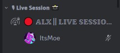
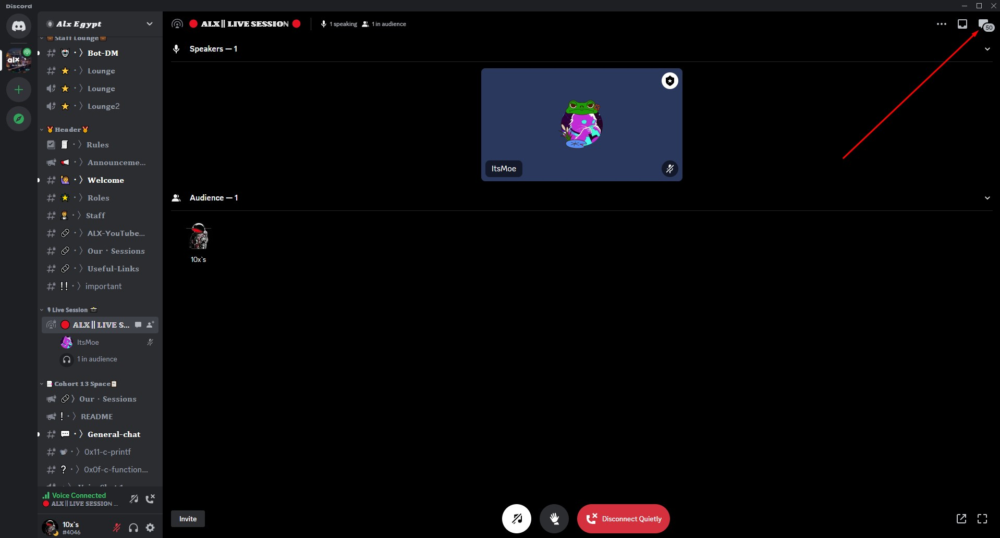
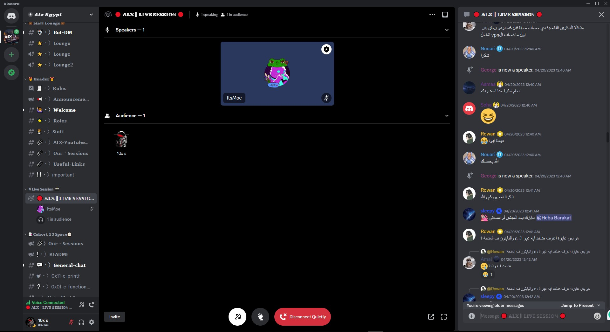
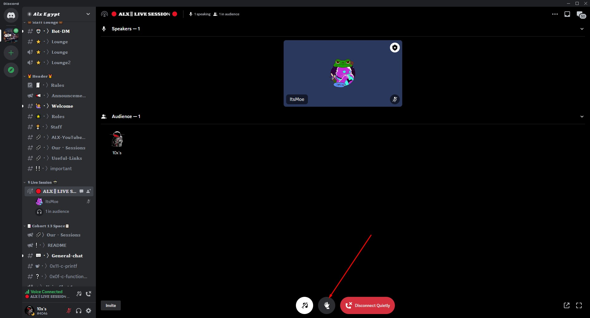
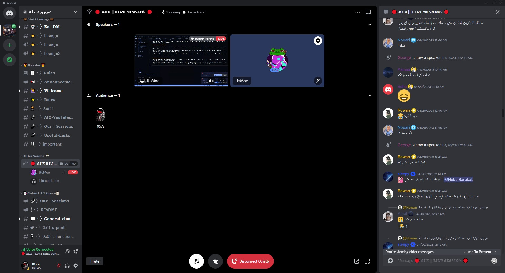
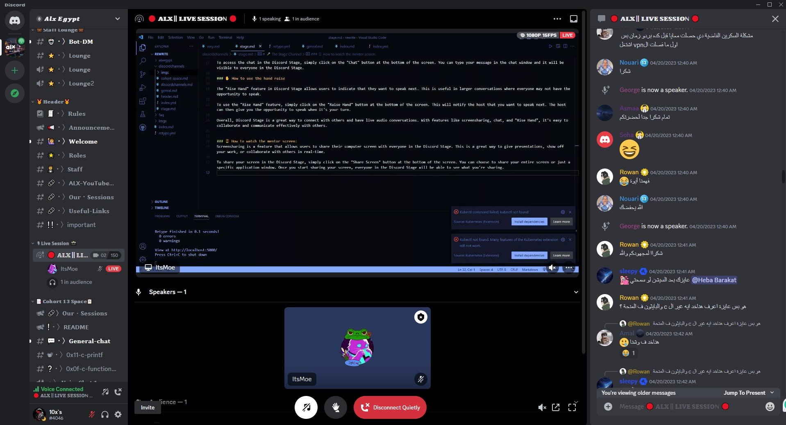

!!!warning This section is coming soon!
!!!

# 🎤 The Stage Channel
The Stage Channel is similar to the Clubhouse app, providing a platform for live sessions and podcasts where community members can share ideas and engage in discussions in real-time. Whether you're a guest speaker or audience member, the Stage Channel offers an interactive and engaging space for sharing knowledge and fostering connections.

## ❔ How to Use the Stage

### 💬 Using the Stage Chat

In addition to audio, Discord Stage also allows users to communicate through text chat, which can be useful for asking questions or sharing links during a session or podcast.

To access the chat, simply click on the chat icon in the top right corner of the screen.

Here's what the chat looks like:

### ✋ Using the Hand Raise

The "Rise Hand" feature in Discord Stage allows users to indicate that they want to speak next. This is especially useful in larger conversations or when you have a question that's hard to explain. Sometimes the host may ask for a vote, in which case you should keep your hand raised until the host lowers it.

To raise your hand, simply click on the hand icon at the bottom of the screen.

### 🖥 Watching the Mentor's Screen
Screensharing is a feature that allows users to share their computer screen with everyone in the Discord Stage. This is a great way to give presentations, show off your work, or collaborate with others in real-time. Whenever a mentor shares their screen, it will appear on top of the Stage Channel.

#### How do i make it bigger?.
simply click on it and it will get bigger this way:

***Tip: You can make it even bigger by closing the chat.***

